# 🚀 Fórum Hub API

API REST desenvolvida com **Java + Spring Boot** para gerenciamento de tópicos de discussão em um fórum.

Esse projeto foi desenvolvido como parte do último **Challenge** do programa **Oracle Next Education G9 (ONE) Alura**.

A aplicação permite que usuários autenticados criem, visualizem, atualizem e excluam tópicos relacionados a cursos.

---

# 🎯 Objetivo do Projeto

Desenvolver uma **API REST completa**, aplicando conceitos importantes de desenvolvimento backend como:

- Spring Security
- Validação e Autenticação de dados
- Autenticação e autorização com **JWT**
- Persistência de dados com **JPA / Hibernate**
- Controle de acesso por usuário

A aplicação simula um **fórum da Alura**, onde os alunos criam tópicos dentro de cursos específicos e discutem dúvidas e/ou soluções.

---

# 🚀 Tecnologias

- Java 17+
- Spring Boot
- Spring Security
- Spring Data JPA
- Flyway
- MySQL
- Maven
- JWT (JSON Web Token)
- Lombok
- Postman (testes de API)

---

# 📌 Funcionalidades

✔ Autenticação de usuários com JWT  

✔ Criação de tópicos  

✔ Listagem de tópicos com paginação  

✔ Visualização de um tópico específico  

✔ Atualização de tópicos  

✔ Exclusão de tópicos  

✔ Associação de tópicos com cursos  

✔ Controle de autorização (somente o autor pode alterar ou deletar seu tópico)

---

# 📏 Regras de Negócio

- Apenas **usuários autenticados** podem criar tópicos.
- Cada tópico possui:
  - título
  - mensagem
  - curso
  - autor
  - data de criação
- A **data de criação é gerada automaticamente pelo sistema**.
- Apenas **o autor do tópico pode atualizar ou excluir seu próprio tópico**.
- Cada tópico está **associado a um curso**.

---

# 📂 Estrutura do Projeto

```
📦 Challenge-Forum_Hub
 ┣ 📂 src
 ┃ ┣ 📂 main
 ┃ ┃ ┣ 📂 java
 ┃ ┃ ┃ ┗ br/com/alura/forumhub
 ┃ ┃ ┃   ┣ 📂 controller
 ┃ ┃ ┃   ┣ 📂 domain
 ┃ ┃ ┃   ┗ 📂 infra
 ┃ ┃ ┗ 📂 resources
 ┣ 📂 docs
 ┃ ┗ 📸 imagens utilizadas no README
 ┣ 📂 Ambiente_de_testes
 ┃ ┣ 📦 ChallengeAlura.postman_collection
 ┃ ┗ 📦 BaseUrl.postman_environment
 ┣ 📜 pom.xml
 ┗ 📜 README.md
```

---

# ⚙️ Aplicando na sua máquina

## 1️⃣ Clonar o repositório

Baixe o projeto ou clone utilizando Git:

git clone git@github.com:Felpsz-Brucciamolino/Challenge-Forum_Hub.git

---

## 2️⃣ Configurar o banco de dados

Abra o arquivo:

src/main/resources/application.properties

Altere as credenciais do banco de dados:

spring.datasource.username=SEU_USUARIO  
spring.datasource.password=SUA_SENHA  

Agora crie um banco de dados MySQL chamado:

CREATE DATABASE forum_hub;

A aplicação utilizará automaticamente esse banco.

---

## 3️⃣ Inicialização automática

Ao rodar o projeto pela primeira vez, uma migration do Flyway criará automaticamente o seguinte usuário:

login: admin  
senha: 123456  

Esse usuário pode ser utilizado para realizar login e gerar o token JWT.

---

## 4️⃣ Criar novos usuários (opcional)

Caso queira criar novos usuários para testes, execute no banco:

INSERT INTO usuarios (login, senha) VALUES ('usuario_teste', '123456');

Exemplo:

INSERT INTO usuarios (login, senha) VALUES ('felipe', '123456');

---

## 5️⃣ Importar os testes no Postman

Para facilitar os testes da API, foi disponibilizada uma Collection do Postman.

Utilize preferencialmente o Postman para evitar problemas de compatibilidade.

Importe os seguintes arquivos:

Ambiente_de_testes/ChallengeAlura.postman_collection  
Ambiente_de_testes/BaseUrl.postman_environment  

### Como importar

1️⃣ Abra o Postman  
2️⃣ Clique em Import  
3️⃣ Selecione os dois arquivos acima  
4️⃣ Ative o Environment:

BaseUrl

Ele já estará configurado com:

http://localhost:8080

---

# 📸 Tutorial visual

### Criar uma pasta e abrir no IntelliJ

<p align="center">
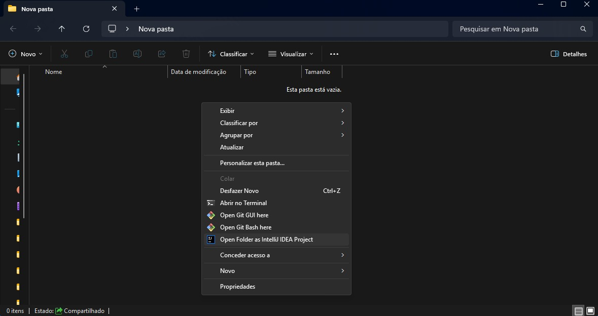
</p>

---

### Clonar o repositório

Abra o terminal do IntelliJ e execute:

git clone git@github.com:Felpsz-Brucciamolino/Challenge-Forum_Hub.git

<p align="center">
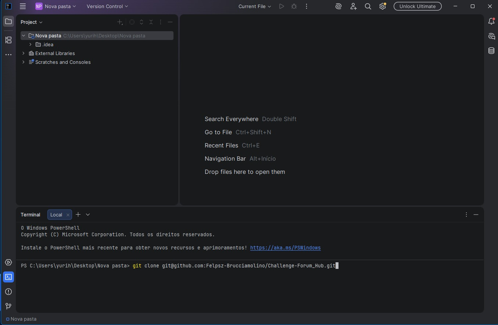
</p>

---

### Abrir o repositório clonado

<p align="center">
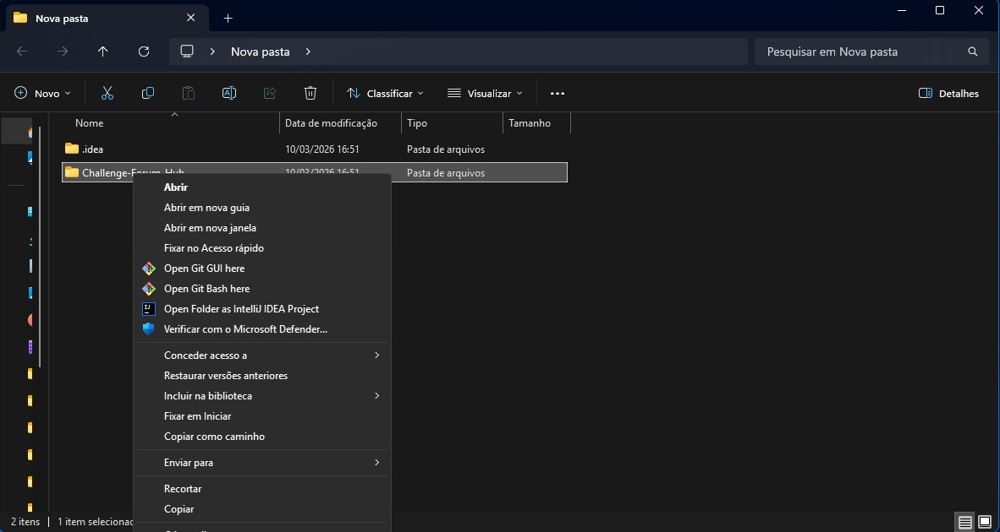
</p>

---

### Criar banco de dados

<p align="center">
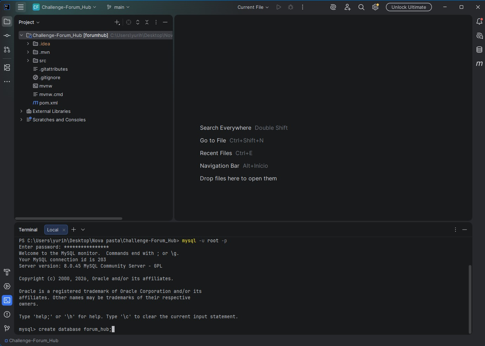
</p>

---

### Usar o banco criado

<p align="center">
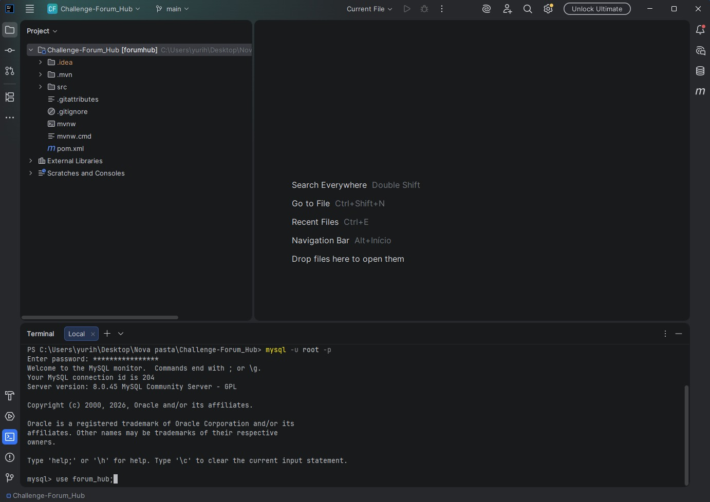
</p>

---

### Executar a aplicação

Abra a classe **ForumHubApplication** e execute.

<p align="center">
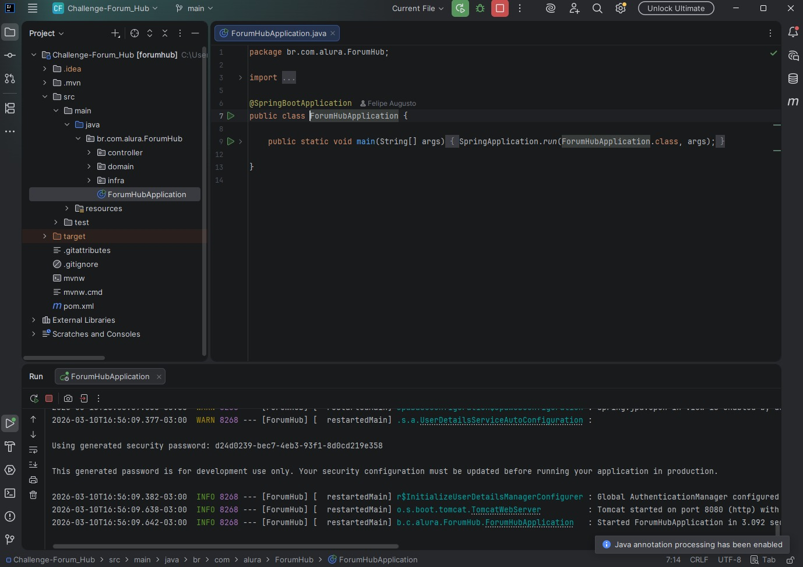
</p>

---

## ✅ Pronto!

Agora sua aplicação está preparada para testes.

Siga o passo a passo abaixo para testar os endpoints.

---

# 🧪 Demonstração da API

## 🔐 Login

Primeiro faça login no Postman para trazer as importações.

<p align="center">
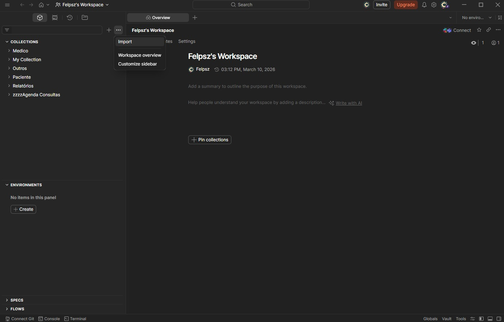
</p>

---

## 📦 Importando coleções e environment

Adicione os seguintes arquivos:

BaseUrl.postman_environment  
ChallengeAlura.postman_collection  

<p align="center">
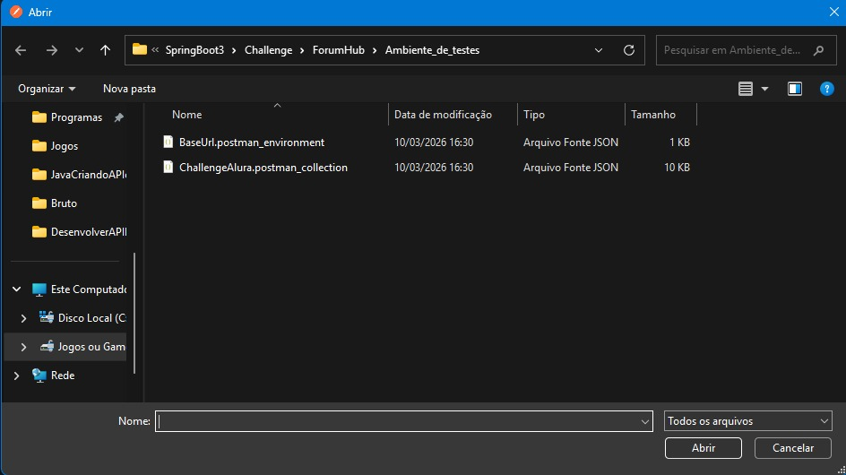
</p>

---

## 🔑 Pegando Token

Acesse **Pegar Token** dentro da pasta **Login** no Postman.  
Coloque um usuário válido e clique em **Send**.

<p align="center">
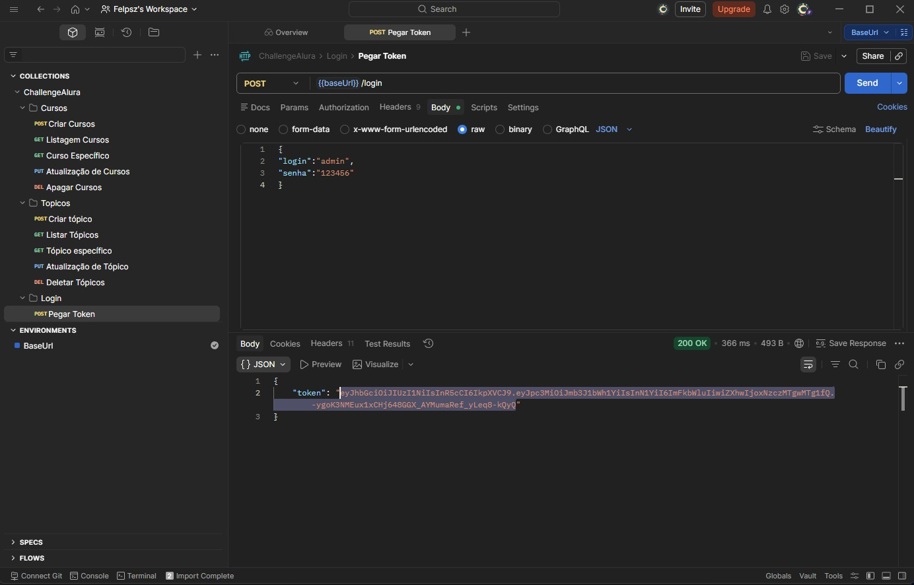
</p>

---

## 🎓 Criar curso

Cole o token copiado em **Authorization → Bearer Token**.

<p align="center">
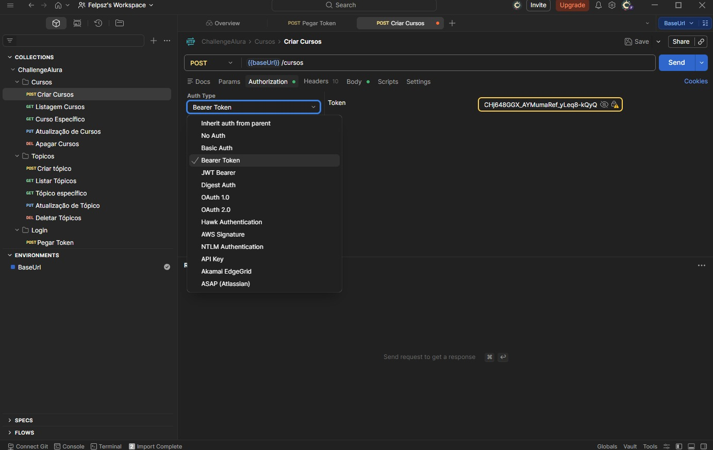
</p>

---

## 📝 Criar tópico

Para criar um tópico é necessário:

- possuir token  
- possuir um curso existente  

<p align="center">
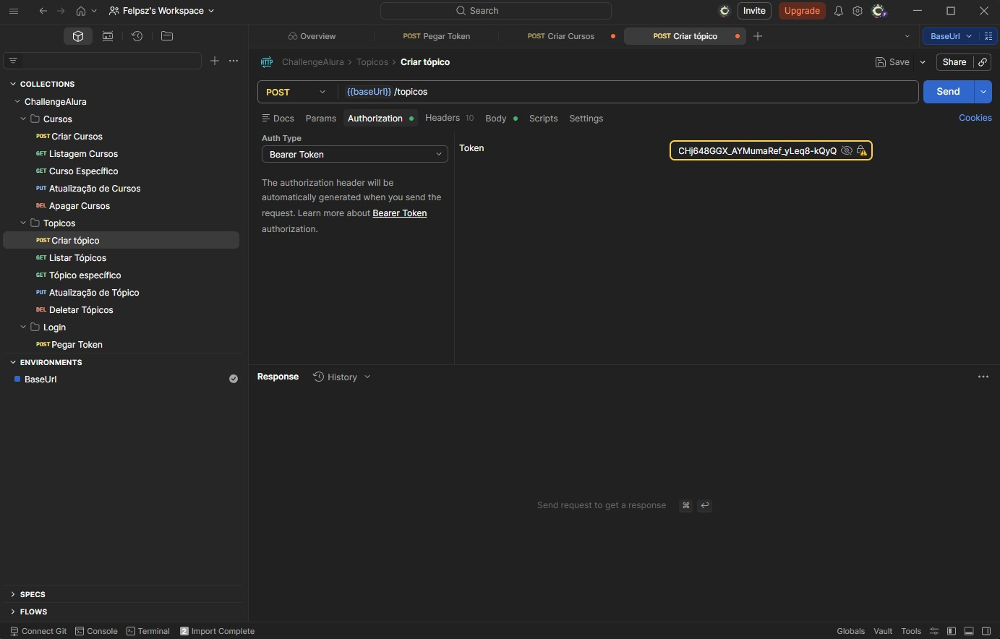
</p>

---

## 📄 Listar tópicos

Não é necessário token para visualizar tópicos ou cursos.

<p align="center">
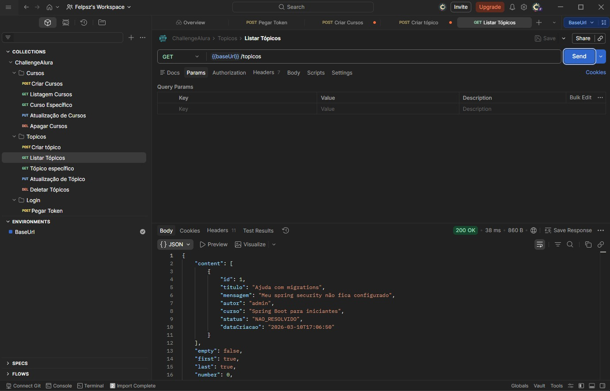
</p>

---

## ❌ Deletar tópico

Apenas o **autor do tópico** pode deletá-lo utilizando o seu próprio token.

<p align="center">
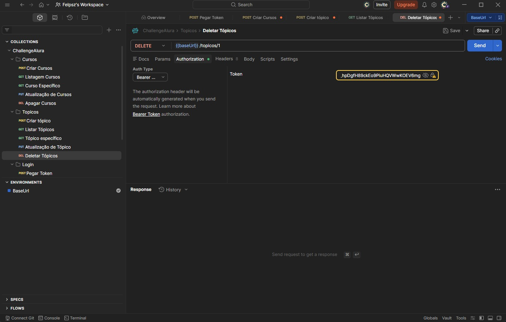
</p>

---

# 👨‍💻 Autor

Desenvolvido por **Felipe Brusamolin** durante o programa **Oracle Next Education G9 (ONE)**.

---

# Agradecimentos

Gostaria de agradecer ao programa **ONE** pela oportunidade de aprendizado e crescimento durante toda essa jornada de 8 meses.

Grande parte do conhecimento que possuo hoje em programação foi construída e desenvolvida graças aos conteúdos, desafios e suporte oferecidos pelo programa e pela Alura em si.

Sem tal oportunidade, provavelmente eu não teria conseguido desenvolver tão rápido as habilidades que atualmente tenho na área de desenvolvimento de software.

Também agradeço à **Alura** principalmente aos instrutores que ajudaram a tornar essa experiência de aprendizado muito mais rica e divertida.
